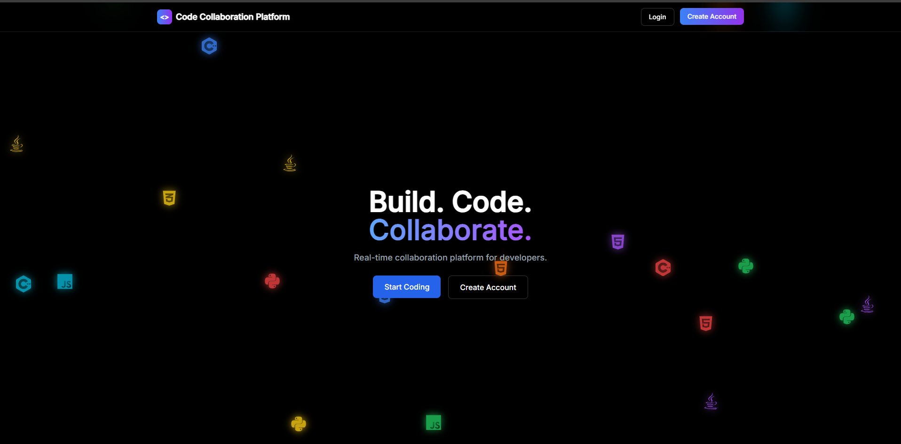
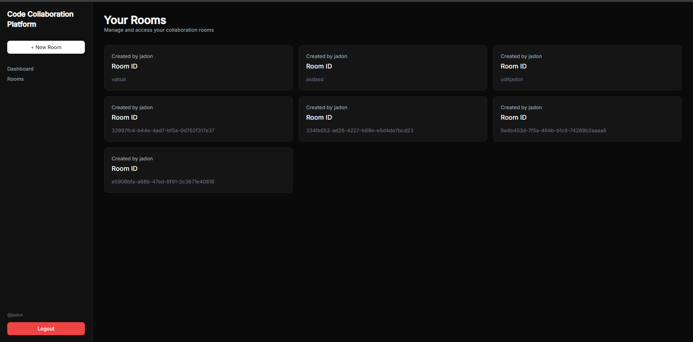
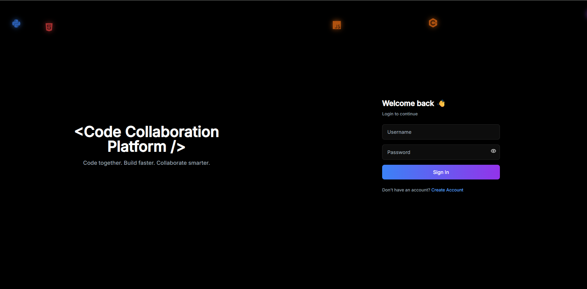
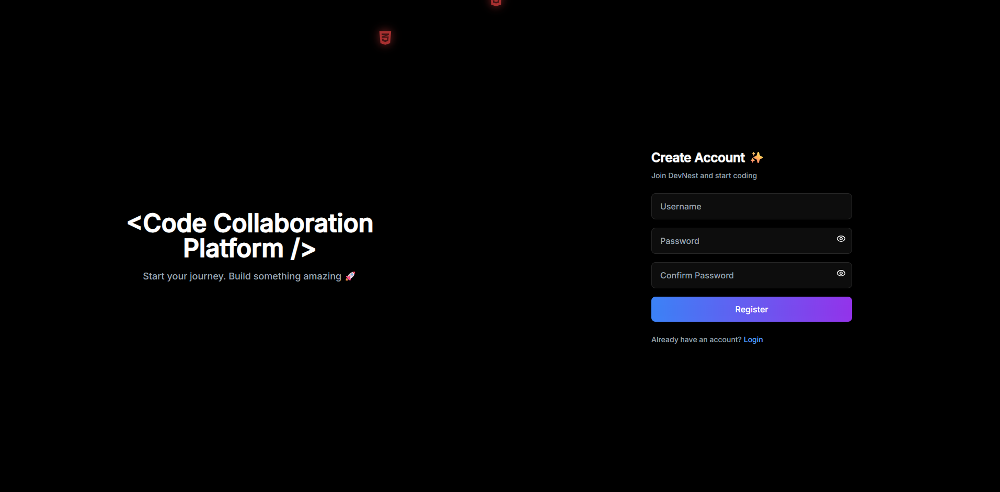
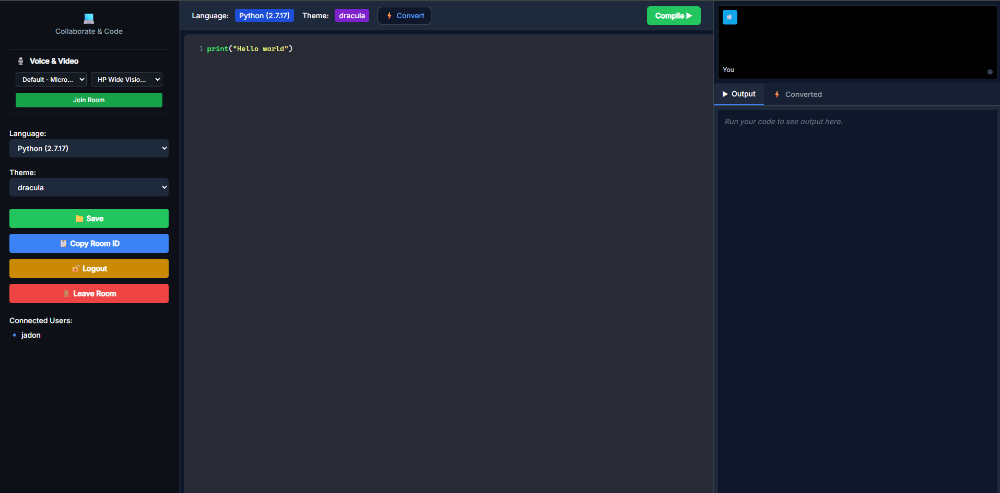

# 🚀 Collaborative Code Editor

<div align="center">


### 🌐 A Real-Time Collaborative Coding Platform

Code together from anywhere with live synchronization, secure authentication, multiple programming languages, and instant collaboration.

⭐ If you like this project, don't forget to **Star** the repository.

</div>

---

# 📖 Overview

**Collaborative Code Editor** is a real-time coding platform that enables multiple developers to collaborate in the same coding room simultaneously.

Whether you're conducting coding interviews, pair programming, teaching students, or working on team projects, this platform provides a smooth collaborative experience powered by **Socket.IO**.

The application ensures that every participant sees code updates instantly without refreshing the page.

---

# ✨ Features

## 🔐 Authentication

- User Registration
- Secure Login
- JWT Authentication
- Protected Routes
- User Profiles

---

## 👨‍💻 Real-Time Collaboration

- Live Code Synchronization
- Multiple Users in One Room
- Join Existing Rooms
- Create Private Coding Rooms
- Room IDs for Easy Sharing

---

## 🎨 Code Editor

- Syntax Highlighting
- Multiple Programming Languages
- Beautiful Themes
- Auto Save
- Smooth Editing Experience

---

## ⚡ Performance

- Fast Socket Communication
- Low Latency Updates
- Optimized React Components
- Responsive UI

---

# 🛠 Tech Stack

## Frontend

- React.js
- Vite
- Tailwind CSS
- React Router
- Axios
- CodeMirror

## Backend

- Node.js
- Express.js
- Socket.IO
- JWT Authentication
- Cookie Parser

## Database

- MongoDB
- Mongoose

---

# 🏗 Project Structure

```
Collaborative-code-editor/
│
├── client/
│   ├── src/
│   ├── public/
│   └── package.json
│
├── server/
│   ├── controllers/
│   ├── middleware/
│   ├── models/
│   ├── routes/
│   ├── socket/
│   └── server.js
│
├── README.md
└── package.json
```

---

# 🚀 Getting Started

## Clone Repository

```bash
git clone https://github.com/asiduki/Collaborative-code-editor.git
```

Move into project

```bash
cd Collaborative-code-editor
```

---

## Install Dependencies

### Backend

```bash
cd server
npm install
```

### Frontend

```bash
cd client
npm install
```

---

# ⚙ Environment Variables

Create a `.env` file inside the **server** folder.

```env

MONGODB_URI=your_mongodb_connection

JWT_SECRET=your_secret_key

GOOGLE_GEMINI_KEY=your_gemini_key
```

Create a `.env` file inside the **client** folder.

```env

VITE_RAPID_API_URL=Your_Key_Here

VITE_RAPID_API_KEY=Your_Key_Here

VITE_RAPID_API_HOST=Your_Key_Here

VITE_API_URL=Your_Key_Here

```

---

# ▶ Running the Project

### Start Backend

```bash
cd server
npm run dev
```

### Start Frontend

```bash
cd client
npm run dev
```

Frontend

```
http://localhost:5173
```

Backend

```
http://localhost:5000
```

---

# 🔄 How It Works

```text
Developer A
      │
      ▼
Socket.IO Server
      ▲
      │
Developer B

Every keystroke is synchronized instantly.
```

---

# 📸 Screenshots

## Landing Page



## DashBoard Page


---

## Login



---

## Register



---

## Collaborative Editor


---

# 🌟 Future Improvements

- Collaborative Whiteboard
- AI Code Suggestions
- File Explorer
- Live Terminal
- Code Execution
- Chat System
- Dark/Light Theme
- Version History
- Invite by Email

---

# 🔒 Security

- JWT Authentication
- Protected API Routes
- Password Encryption
- Secure Cookies
- MongoDB Validation

---

# 📚 Learning Outcomes

This project helped in understanding:

- React Architecture
- Express APIs
- MongoDB Integration
- JWT Authentication
- Socket.IO
- Real-Time Communication
- REST APIs
- State Management
- Full Stack Development

---

# 🤝 Contributing

Contributions are always welcome.

1. Fork the repository

2. Create a feature branch

```bash
git checkout -b feature/NewFeature
```

3. Commit changes

```bash
git commit -m "Added new feature"
```

4. Push

```bash
git push origin feature/NewFeature
```

5. Open a Pull Request

---

# 🐞 Found a Bug?

Please open an issue describing:

- Steps to reproduce
- Expected behavior
- Actual behavior
- Screenshots (if available)

---

# 👨‍💻 Author

## Udit Jadon

**Full Stack MERN Developer**

- 💼 React.js
- ⚡ Node.js
- 🍃 MongoDB
- 🚀 Express.js
- 🌍 Socket.IO

GitHub

https://github.com/asiduki

---

# ⭐ Show Your Support

If you found this project helpful,

⭐ Star this repository

🍴 Fork it

🛠 Contribute

📢 Share it with others

---

<div align="center">

### Made with ❤️ using MERN Stack & Socket.IO

**Happy Coding 🚀**

</div>